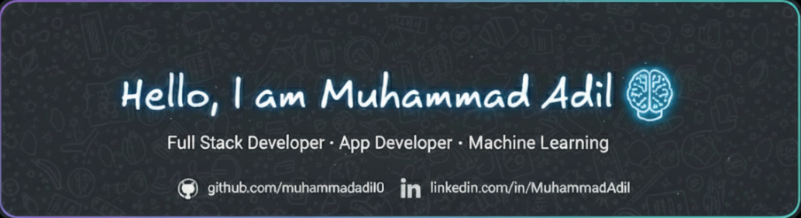

 

<h1 align="center">Hi 👋, I'm Muhammad Adil</h1>
<h3 align="center">Flutter Dev | AI & ML Explorer | Full-Stack Project Builder</h3>

Flutter Development • Machine Learning • Full-Stack Development • Automation

  
  
  
  
  

- 🔭 Currently developing **OTC Medicine Self-Awareness** (Research Project) and **Blood Bank Management System** (Startup Project).  
- 🧩 Exploring **AI/ML**, **Flutter Development**, and **Full-Stack Development** to build smart, real-world solutions.  
- 🤝 Open to collaborating on Machine Learning projects and automation frameworks.  
- 💬 Ask me about Django, Flask, PHP, Flutter, Machine Learning.  
- 📫 Reach me at: adilraxiq64@gmail.com

<h3 align="left">Connect with me:</h3>

### Tech Stack

| Mobile / App Development | Web / Frontend | Backend / Frameworks | Databases |
|-------------------------|----------------|---------------------|-----------|
|     |     |     |    |

| ML / AI / Data Science | DevOps / Tools | System / Languages |
|----------------------|----------------|-------------------|
|     |    |      |

&nbsp;

  

  
  
  

