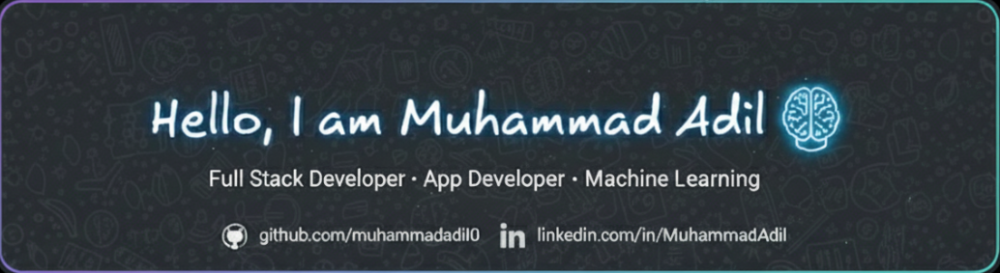

 

<h1 align="center">Hi 👋, I'm Muhammad Adil</h1>
<h3 align="center">
Backend Engineer | AI Engineer | Cloud & DevOps Enthusiast
</h3>

Node.js • Express.js • PostgreSQL • MongoDB • Redis • Docker • AWS • AI • Automation

## 🚀 Featured Project

### 🛡️ Threat Intelligence Validation Platform (Final Year Project)

A cybersecurity platform that validates and scores threat intelligence using AI and machine learning. The system helps security teams identify trustworthy Indicators of Compromise (IOCs), detect misinformation, and improve cyber threat analysis.

#### ✨ Features
- 🤖 AI-powered credibility scoring
- 🔍 IOC validation
- 📊 Threat intelligence dashboard
- 📈 Machine Learning analysis
- 🔐 Secure authentication
- ⚡ REST API architecture

🔗 **Project Repository:** https://github.com/greykaizen/ThreatChain

📝 **Read the Research Article**
> [The Trust Gap in Threat Intelligence: Why Your Feeds Are Lying to You](https://dev.to/adil_raxiq_d6b4d8714f9fe0/the-trust-gap-in-threat-intelligence-why-your-feeds-are-lying-to-you-31bm)

  
  
  
  
  

- 🔭 Currently developing **OTC Medicine Self-Awareness** (Research Project) and **Blood Bank Management System** (Startup Project).  
- 🧩 Exploring **AI/ML**, **Flutter Development**, and **Full-Stack Development** to build smart, real-world solutions.  
- 🤝 Open to collaborating on Machine Learning projects and automation frameworks.  
- 💬 Ask me about Django, Flask, PHP, Flutter, Machine Learning.  
- 📫 Reach me at: adilraxiq64@gmail.com

<h3 align="left">Connect with me:</h3>
<table>
  <tr>
    <td></td>
    <td></td>
    <td></td>
    <td></td>
    <td></td>
    <td></td>
    <td></td>
  </tr>
</table>

### Tech Stack

| Mobile / App Development | Web / Frontend | Backend / Frameworks | Databases |
|-------------------------|----------------|---------------------|-----------|
|     |     |     |    |

| ML / AI / Data Science | DevOps / Tools | System / Languages |
|----------------------|----------------|-------------------|
|     |    |      |

## 📊 GitHub Statistics

  
  <!-- GitHub Streak Stats - Using demolab service (reliable) -->
  
  

  
  <!-- Profile Views Counter -->
  
  

  
  <!-- GitHub Stats Badges using Shields.io (reliable, no Vercel) -->
  
  
  

  
  
  

  
  
  

